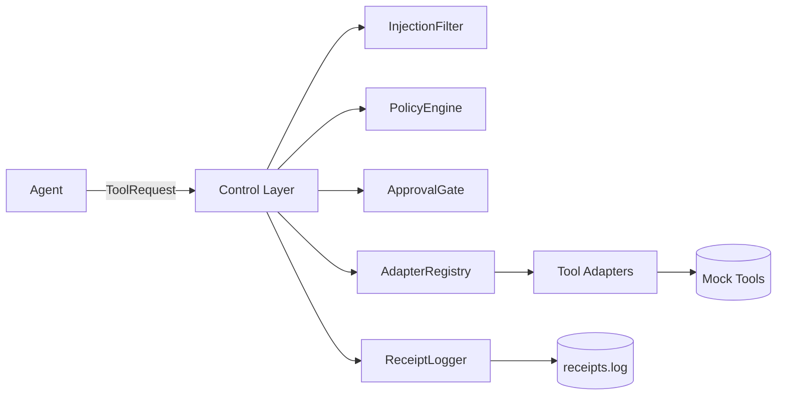

ToolGate

## Architecture



## Quickstart

Install dependencies:

```bash
pip install pydantic typer pyyaml python-dotenv
```

Run the demo scenarios:

```bash
export GATEWAY_SECRET="dev-secret"
python -m gateway run --profile configs/policy_practical.yaml
```

Run with strict policy:

```bash
python -m gateway run --profile configs/policy_strict.yaml
```

Generate an approval token from an approval request:

```bash
python -m gateway approve --input-file approval.json
```

Receipts are written to `./receipts.log` by default (override with `--receipts`).
